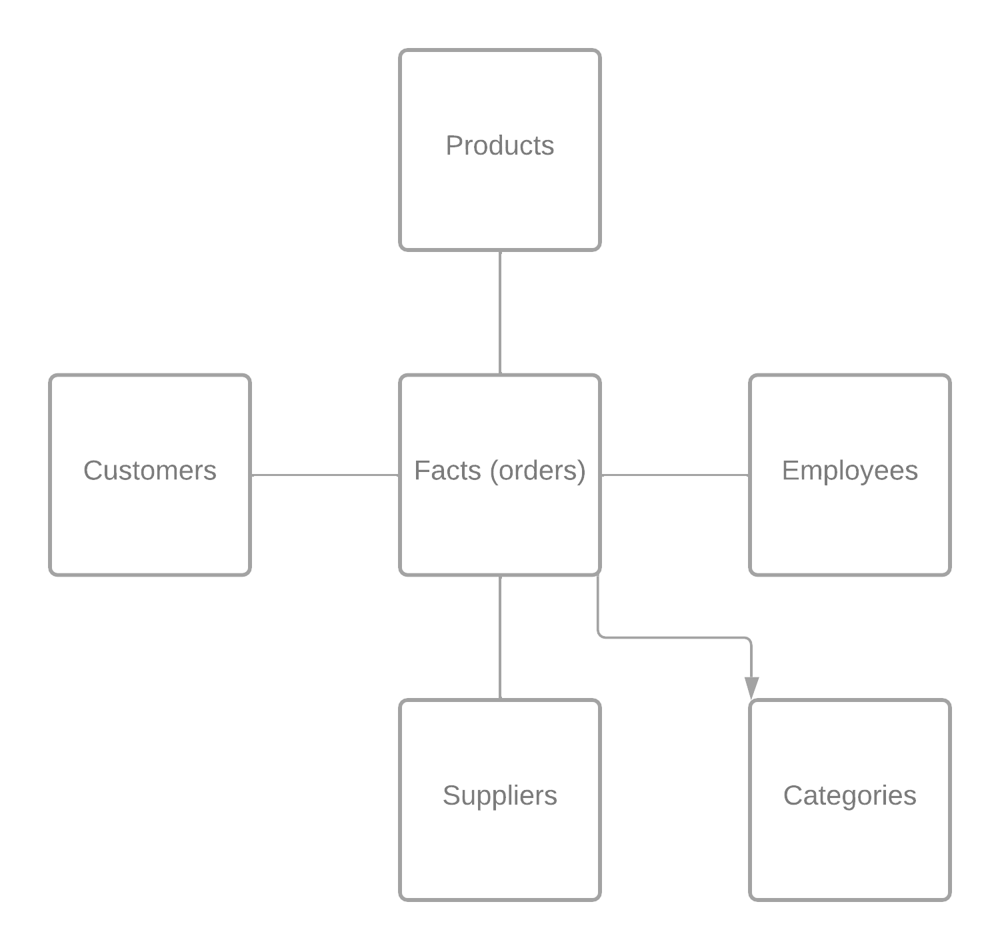

# TECHNICAL TEST : CREATE A STAR SCHEMA

## Star Schema 

I designed the following star schema : <br>

<br>

I put the the orders at the center and as the table fact, because from a business point of view we want to quantify and analyse the amount of sales. <br>
Around it, there are the dimension tables :
* products
* customers
* suppliers
* employees
* categories

<br>

Because in the future, we might want to use these dimensions to conduct sales analysis.

<br>

I could/should have created a time dimension, so instead of created_date in the fact table, there would be time_id
with the associate time table. But because I have been asked for a 1-2 hours solution, I simply added created_date straight to the fact table.

## Facts table creation

I used two docker containers to achieve this task, one that will aim to initialize postgres requirements and will handle the databases. <br>
Another one in which, the SQL code will be ran. <br>
I used two containers, so I don't overwrite the natural entry point of the postgres container. <br> <br>

So to get started, you can run :
```docker compose up```

On a new terminal you can run the ```docker ps``` command to get the container_id of the postgres container. <br>

Then run : 
```docker exec -it {container-id} bash```

And once you are inside the container :
```psql -h $POSTGRES_HOST -U $POSTGRES_USER -d $POSTGRES_DB```

Then to check everything went fine : 
```SELECT * from facts limit 10;```